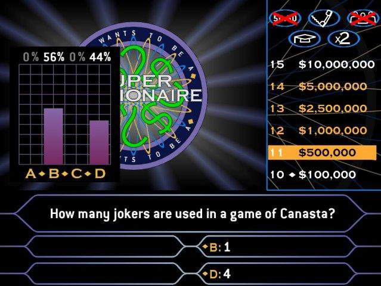
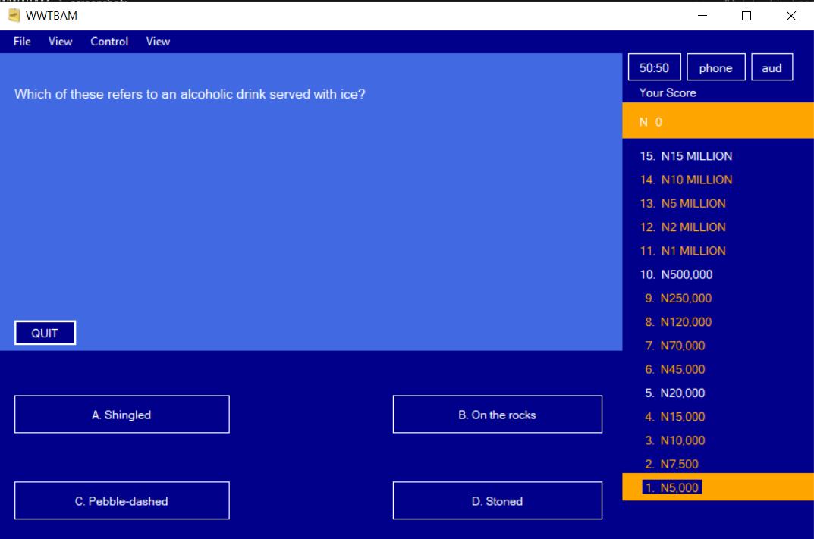
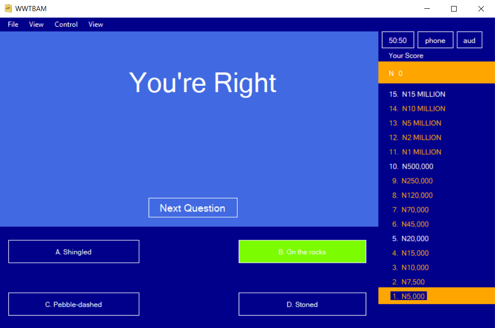
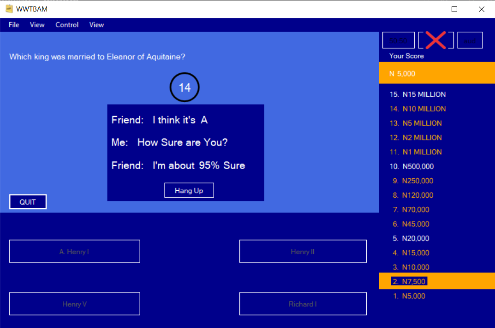

<h1 align="center">WHO WANTS TO BE A MILLIONAIRE - WWTBAM</h1>

## About WWTBAM

WWTBAM is a desktop application written using the VB.NET programming language. As a beginner in 2018, I thought to make a little clone of the app I was using to play then just for learning purposes and nothing else. I'm making the code available here because it just might be of help to a beginner as well.
 
Below is the image of the desktop app I used.

<h4 align="center">WWTBAM APP IMAGE</h4>

    

 

# APP SCREENSHOTS

The following are some of the screenshots of the application

 

 

Hope this helps someone, Thanks!